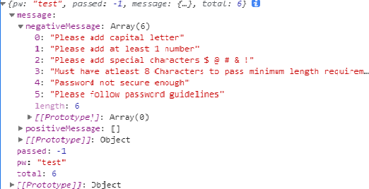
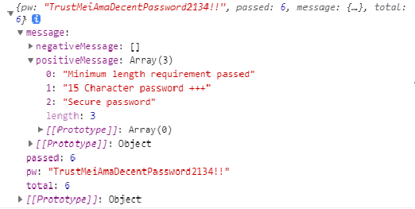

# Strict password checker


Root URL: 

# Example:

```javascript
fetch()
      .then(res => res.json())
      .then(data => console.log(data))
```

## response:


```javascript
fetch()
      .then(res => res.json())
      .then(data => console.log(data))
```

## response:


## Password checker checks for:

<ul>
<li>lower case a-z</li>
<li>upper case a-z</li>
<li>Numbers 0-9</li>
<li>Special Chars: $@#&!</li>
<li>Password length greater than 8</li>
<li>Extra password strength score for 15 or more characters<li>
</ul>
